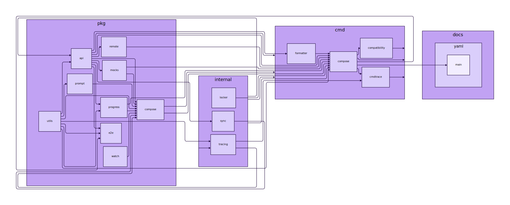

<h1 align="center">
Euler
</h1>
<p align="center">Generate dependency graph from golang structs and components</p>

<p align="center">
<a href="https://pkg.go.dev/github.com/mehditeymorian/euler/v1?tab=doc"target="_blank">
    
</a>&nbsp;


</p>

## Installation
```shell
go install github.com/mehditeymorian/euler@latest
```

## How to Use

### Generate for Components
Generate graph for component
```shell
euler component -p GIT_REPO|LOCAL_DIR
```

For example the following is dependency graph is for [Docker Compose](https://github.com/docker/compose) project.




### Generate for Struct Models
```shell
euler struct -p ./structs-dir -e "a.go,b.go,c.go" -f
# output: out.svg
```